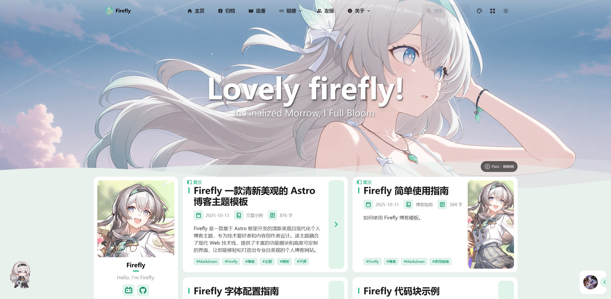
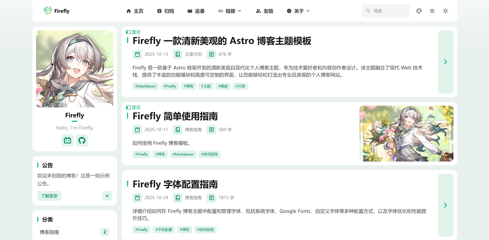
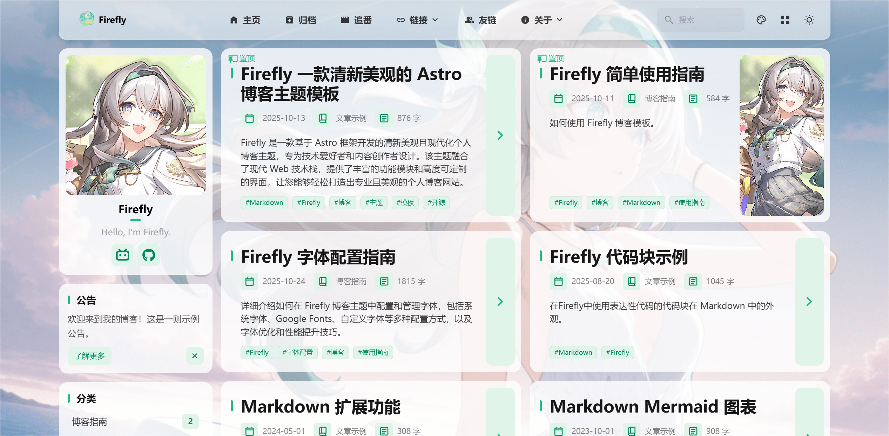

<div align="center">

# Firefly
> A fresh and beautiful Astro blog theme template
</div>


---

[**🖥️ Live Preview (Netlify)**](https://demo-firefly.netlify.app/) /
[**📝 Documentation**](https://docs-firefly.cuteleaf.cn/) /
[**🍀 My Blog**](https://blog.cuteleaf.cn) 

⚡ Static Site Generation: Ultra-fast loading speed and SEO optimization based on Astro

🎨 Modern Design: Clean and beautiful interface, supporting custom theme colors

📱 Mobile Friendly: Perfect responsive experience, specially optimized for mobile devices

🌟 Mascot Support: Supports both Spine and Live2D animation engines

🔧 Highly Configurable: Most functional modules can be customized through configuration files



<table>
  <tr>
    <td valign="top"></td>
    <td valign="top"></td>
  </tr>
 </table>

## ✨ Features

### Core Features

- [x] **Astro + Tailwind CSS** - Ultra-fast static site generation based on a modern tech stack
- [x] **Smooth Animations** - Swup page transition animations for a silky browsing experience
- [x] **Responsive Design** - Perfectly adapts to desktop, tablet, and mobile devices
- [x] **Multi-language Support** - i18n internationalization, supporting Simplified Chinese, Traditional Chinese, English, Japanese, and Russian
- [x] **Full-text Search** - Client-side search based on Pagefind, supporting article content indexing

### Personalization

- [x] **Custom Theme Color** - 360° hue adjustment, supporting light/dark/system-sync modes
- [x] **Wallpaper Mode Switching** - Banner wallpaper, full-screen wallpaper, solid background, one-click switch on the frontend
- [x] **Layout Switching** - List/grid layout, freely switchable on the frontend
- [x] **Font Management** - Supports custom fonts and rich font selectors
- [x] **Sakura Effect** - Configurable falling sakura animations

### Page Components

- [x] **Table of Contents (TOC)** - Auto-generated, supporting both desktop and mobile
- [x] **Sidebar Configuration** - Can be toggled/switched between left and right, rich sidebar components
- [x] **Navbar Customization** - Fully customizable Logo, title, and links
- [x] **Friends Links** - Exquisite friend link display cards
- [x] **Announcement Board** - Top announcement prompt, supporting closure and custom styles
- [x] **Footer Configuration** - HTML content injection, fully customizable
- [x] **About Page** - Custom personal introduction

### Media Features

- [x] **Music Player** - Supports local music and Meting API online music (NetEase Cloud / QQ Music, etc.)
- [x] **Mascot (Live2D/Spine)** - Supports both Spine and Live2D animation engines
- [x] **Anime Page** - Anime tracking record display based on Bangumi API

### Interactive Features

- [x] **Comment System** - Integrated Twikoo comment system
- [x] **Visit Tracking** - Visit tracking built into Twikoo
- [x] **Enhanced Code Blocks** - Based on Expressive Code, supporting code folding, line numbers, and language identifiers
- [x] **Math Formulas** - KaTeX rendering engine, supporting inline and block-level formulas
- [x] **Image Lightbox** - Fancybox image preview function
- [x] **RSS Feed** - Auto-generated RSS Feed
- [x] **Sitemap** - Auto-generated XML Sitemap, supporting page filtering configuration

### Performance Optimization

- [x] **Image Optimization** - Astro Image automatic processing
- [x] **Code Splitting** - Automatic on-demand loading
- [x] **SEO Optimization** - Complete meta tags and structured data
- [x] **Lazy Loading** - Images and components load on-demand
- [x] **Sitemap Optimization** - Auto-generated sitemap-index.xml and multi-level sitemaps

## 📝 Planned...

- [ ] **Refactor Live2D Mascot**
- [ ] **Provide more optional comment systems**
- [ ] **Fix anime page data loading issues**
- [ ] More features continuously improving...

If you have great features and optimizations, please submit a [Pull Request](https://github.com/CuteLeaf/Firefly/pulls)

## 🚀 Quick Start

### Environment Requirements

- Node.js ≤ 22
- pnpm ≤ 9

### Local Development Deployment

1. **Clone the repository:**
   ```bash
   git clone https://github.com/Cuteleaf/Firefly.git
   cd Firefly
   ```

2. **Install dependencies:**
   ```bash
   # If pnpm is not installed, install it first
   npm install -g pnpm
   
   # Install project dependencies
   pnpm install
   ```

3. **Configure the blog:**
   - Edit the configuration files under the `src/config/` directory to customize your blog settings

4. **Start the development server:**
   ```bash
   pnpm dev
   ```
   The blog will be available at `http://localhost:4321`

### Platform Hosting Deployment

- **Refer to the [Official Guide](https://docs.astro.build/zh-cn/guides/deploy/) to deploy your blog to Vercel, Netlify, GitHub Pages, etc.**

## 📖 Configuration Guide

> 📚 **Detailed Configuration Docs**: Check the [Firefly Documentation](https://docs-firefly.cuteleaf.cn/) for complete configuration guides

### Configuration File Structure

```
src/
├── config/
│   ├── index.ts              # Configuration index file
│   ├── siteConfig.ts         # Site basic configuration
│   ├── profileConfig.ts      # User profile configuration
│   ├── commentConfig.ts      # Comment system configuration
│   ├── announcementConfig.ts # Announcement configuration
│   ├── licenseConfig.ts      # License configuration
│   ├── footerConfig.ts       # Footer configuration
│   ├── FooterConfig.html     # Footer HTML content
│   ├── expressiveCodeConfig.ts # Code highlight configuration
│   ├── sakuraConfig.ts       # Sakura effect configuration
│   ├── fontConfig.ts         # Font configuration
│   ├── sidebarConfig.ts      # Sidebar layout configuration
│   ├── navBarConfig.ts       # Navbar configuration
│   ├── musicConfig.ts        # Music player configuration
│   ├── pioConfig.ts          # Mascot configuration
│   ├── adConfig.ts           # Advertisement configuration
│   └── friendsConfig.ts      # Friends link configuration
```


## ⚙️ Post Frontmatter

```yaml
---
title: My First Blog Post
published: 2023-09-09
description: This is the first post of my new Astro blog.
image: ./cover.jpg
tags: [Foo, Bar]
category: Front-end
draft: false
lang: jp      # Only required when the post language is different from the site language in `config.ts`
---
```

## 🧞 Commands

All the following commands need to be executed in the project root directory:

| Command                           | Action                            |
|:----------------------------------|:----------------------------------|
| `pnpm install` and `pnpm add sharp` | Install dependencies              |
| `pnpm dev`                        | Start local dev server at `localhost:4321` |
| `pnpm build`                      | Build site to `./dist/`           |
| `pnpm preview`                    | Preview built site locally        |
| `pnpm new-post <filename>`        | Create a new post                 |
| `pnpm astro ...`                  | Execute `astro add`, `astro check` etc. |
| `pnpm astro --help`               | Show Astro CLI help               |

## 🙏 Acknowledgements

- Thanks to the original [Fuwari](https://github.com/saicaca/fuwari) template
- Thanks to the [Mizuki](https://github.com/matsuzaka-yuki/Mizuki) template based on Fuwari
- Thanks to Bilibili uploader [公公的日常](https://space.bilibili.com/3546750017080050) for the chibi Firefly mascot slice data model
- Built with [Astro](https://astro.build) and [Tailwind CSS](https://tailwindcss.com)
- Icons from [Iconify](https://iconify.design/)

## 🍀 Contributors

Thanks to the following contributors for their contributions to this project. If you have any questions or suggestions, please submit an [Issue](https://github.com/CuteLeaf/Firefly/issues) or [Pull Request](https://github.com/CuteLeaf/Firefly/pulls).

<a href="https://github.com/CuteLeaf/Firefly/graphs/contributors">
  
</a>


## ⭐ Star History

[](https://star-history.com/#CuteLeaf/Firefly&Date)
